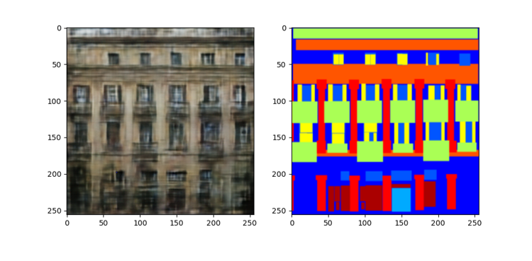

## Image-to-Image Translation with Conditional Adversarial Networks
**기간: 2024.06.17 ~2024.06.20**

1.	논문 읽기
2.	모델 구현
3.	실험
   
**논문 주요 내용**  
Image-to-Image: labels to Street Scene, Labels to Façade, BW to Color, Aerial to Map, Edges to Photo 등 다양한 분야가 많음. 이들은 Pixel 별로 예측이라는 공통점을 가지고 있음.그러나 해결 알고리즘은 모두 다름 즉 저자는 공통점인 Framework를 제안함. 기존방식들은 CNN 많이 이용. 그러나 CNN은 loss function을 최소 하는데 초점을 맞추어 학습함.그러므로 효과적인 loss를 만드는데 노력이 필요 그러나 GAN loss는 기존의 loss보다 high-level goal 을 목표로 한다. Discriminator를 이용하여 Generator가 생성한 이미지를 가짜인지 진짜인지 식별하는 과정을 거치기 때문에 이미지 전체의 퀄리티가 좋아질 수밖에 없음. 그러나 기존의 GAN 과 다르게 저자는 image-to-image Task들은 input 이미지와 완전히 같은 구조의 이미지를 만들기 위해 고수준의 세밀한 부분도 고려하여Discriminator는 PatchGAN , Generator에는 기존 GAN과 동일시하고  L1 term을 추가하여 저수준의 이미지 전체적인 부분과 고수준의 세밀한 부분 모두 학습 시킬 수 있음.

**알게 된 개념**  
1.	L1 distance vs L2 distance
L1 norm, L2 norm -> 이미지를 blurry하게 만든다.
작고 여러 오류가 있는 경우와 큰 오류인데 적은 오류가 있는 경우
L1norm과 L2 norm 둘 다 픽셀별로 빼고 평균을 내므로 작은 오류보다 큰 오류에 loss가 크다. 즉 전체적인 이미지 구조(저수준) 중요시!!->그래서 이미지 세밀한 퀄리티는 떨어져도 전체적인 구조가 남아있는(blurry)
2.	MSE loss, Cross Entropy loss vs GAN loss
Structure loss vs Unstructure loss
Pixel 독립적 vs 상호작용 서로
3.	Test method 구현
4.	Baseline 구축
5.	모델 구성 방법
6.	실험 결과

**추가적인 공부가 필요하다고 생각 한 부분**            
 GAN 수학적인 부분

